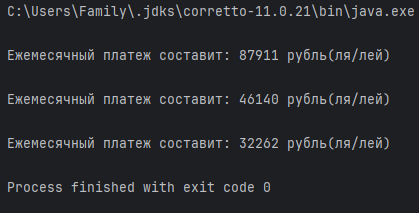

# Создание программы расчета ежемесячного платежа по кредиту

_Цель_: закрепить знания основ объектно-ориентированного программирования (сервисные классы, многофайловая программа)

# Входные данные:

- сумма кредита 1 000 000 руб.
- ставка 9.99% годовых
- 3 варианта срока выплаты кредита:
    1. 1 год
    2. 2 года
    3. 3 года
  
# Выходные данные:

вывод в консоль суммы ежемесячного платежа для трех вариантов срока кредитования

